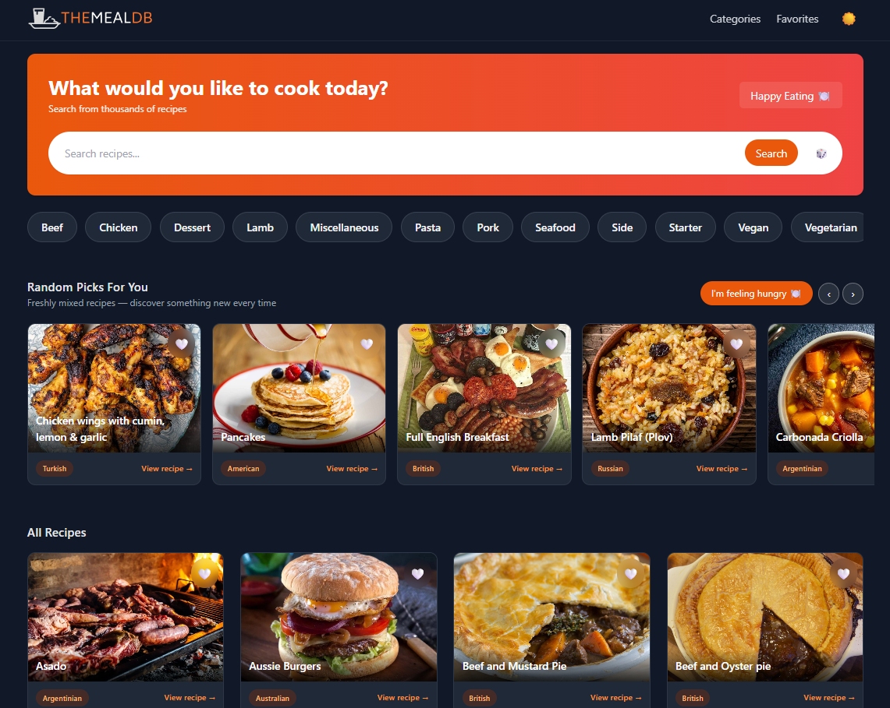

# 🍽️ **TheMealDB Explorer**  
A modern, elegant, high-performance recipe discovery app powered by **React + Vite**, **Node.js**, **Express**, and **TheMealDB API**.  
Search, browse, save favorites, explore categories, and discover random dishes — all with a stunning UI and buttery-smooth UX.

---

## 🚀 **Tech Stack**

### 🖥️ **Frontend**


### 🛠️ **Backend**


### 🗄️ **API**
📡 **TheMealDB Public REST API**

---

## ✨ **Features**

### 🔍 Smart Search with Live Suggestions
- Auto suggestions (with images)
- Scrollable dropdown  
- Press **Enter** or click to search
- Blends perfectly with UI

### 🎲 Random Picks (Netflix Slider)
- Smooth horizontal scroll  
- Arrow navigation  
- "I'm felling hungry 🍽️" button  
- Category-aware random generator  
- Animated shimmer loading

### 🍱 Explore Categories
- Full-screen category page  
- Image-based category cards  
- Smooth fade/zoom animations  
- Click → meals from that category

### ❤️ Favorites
- Save/unsave any meal  
- Auto-persist in LocalStorage  
- Favorites page with grid layout

### 🌗 Global Dark / Light Mode
- Single hook (`useDarkMode.js`)  
- Auto recolors text, cards, backgrounds  
- No manual per-component edits  

---

## 📂 **Project Structure**

### 🖥️ **Backend**
```
backend/
 ├─ src/
 │   ├─ config/
 │   ├─ controllers/
 │   ├─ routes/
 │   ├─ services/
 │   ├─ utils/
 │   └─ app.js, server.js
└─ package.json
```

### 💻 **Frontend**
```
frontend/
 ├─ src/
 │   ├── api/
 │   ├── assets/
 │   ├── components/
 │   ├── hooks/
 │   ├── pages/
 │   ├── App.jsx
 │   ├── index.css
 │   └── main.jsx
 ├─ tailwind.config.js
 ├─ vite.config.js
 └─ package.json
```

---

# ⚙️ **Setup Instructions**

## 🔧 Backend Setup
```
cd backend
npm install
```

Create `.env`:
```
PORT=5000
MEALDB_BASE_URL=https://www.themealdb.com/api/json/v1/1/
```

Start server:
```
npm start
```

---

## 🎨 Frontend Setup
```
cd frontend
npm install
npm run dev
```

Runs at:
```
http://localhost:5173
```

---

# 📡 **API Endpoints (Backend)**

Below is the full backend API reference with example JSON 📘.

---

## 🔍 **Search Meals**  
**GET** `/api/meals/search?q=chicken`

### ✔ Response
| Field | Type | Description |
|-------|-------|-------------|
| success | boolean | Was request successful |
| cached | boolean | Loaded from cache or not |
| data.meals | array | List of matched meals |

### 📘 Example
```json
{
  "success": true,
  "cached": false,
  "data": {
    "meals": [
      {
        "idMeal": "52772",
        "strMeal": "Chicken Handi",
        "strMealThumb": "https://..."
      }
    ]
  }
}
```

---

## 📁 **Categories**
**GET** `/api/meals/categories`

| Field | Type |
|-------|------|
| strCategory | string |
| strCategoryThumb | string |
| strCategoryDescription | string |

---

## 🍽️ **Meals by Category**
**GET** `/api/meals/category/Chicken`

| Field | Type |
|-------|------|
| idMeal | string |
| strMeal | string |
| strMealThumb | string |

---

## 🎲 **Random Meals**  
**GET** `/api/meals/random` → Returns **5 meals**

---

## 📦 **All Meals (preloaded)**  
**GET** `/api/meals/all`  
Loads minimal meals instantly + merges cached full meals automatically.

---

## 🔍 **Meal Details**
**GET** `/api/meals/details/:id`

---

# 🖼️ Screenshots (Optional)
> 

---

# 🤝 Contributing  
Pull Requests are welcome!  
Follow the standard GitHub fork → branch → commit → PR workflow.

---

# 📜 License  
MIT License © 2025

---

# ⭐ If you like this project…  
Give it a star 🌟 on GitHub — it really helps!

